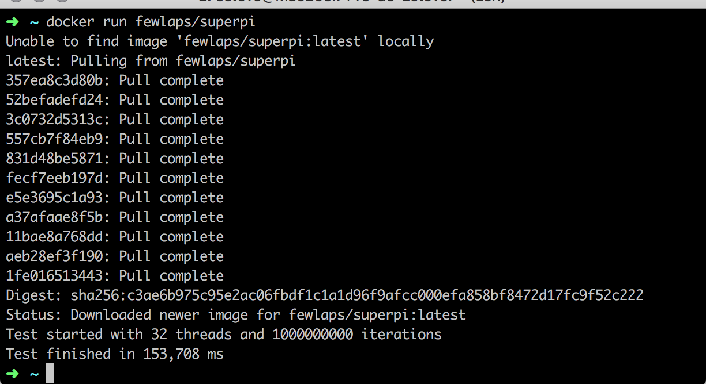

# SuperPI
If you are a hardware nerd like me, you know SuperPI for sure. If not, SuperPI is a Windows application useful to benchmark your CPU.

As there's any simple way to benchmark servers performance, we written this project that tests your CPU without installing nothing: simply running the image on Docker

```bash
docker run fewlaps/superpi
```

By default, the app runs 32 threads and 1000000000 iterations over the Gauss-Legendre algorithm to approximate the Pi decimals. If you want to customize that numbers, don't hesitate to do it:

```bash
docker run fewlaps/superpi -t numberOfThreads
docker run fewlaps/superpi -i numberOfIterations
docker run fewlaps/superpi -t numberOfThreads -i numberOfIterations
```

## Some results

Running the default test on different machines took...

Computer|Year|CPU|Time
------- | -- | -- | -------
Windows desktop|Mid 2013|3.5 GHz i7|**33,586 ms**
iMac 21,5"|Late 2013|3.1 GHz i7|**36.852 ms**
MacBook Pro 13"|Early 2015|3.1 GHz i7|**64,973 ms**
MacBook Pro 13"|Early 2015|2.9 GHz i5|**67,004 ms**
MacBook Pro 13"|Late 2013|2.4 Ghz i5|**85.998 ms**
MacBook Air 13"|Mid 2012|1.8 GHz i5|**93,775 ms**


